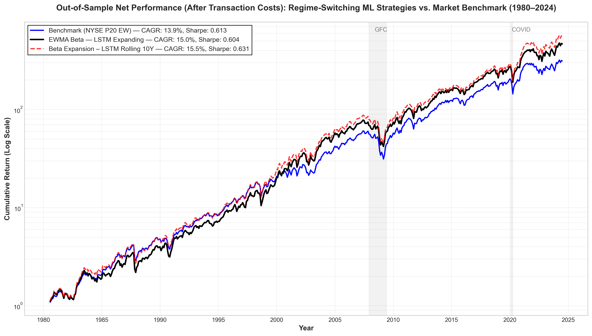
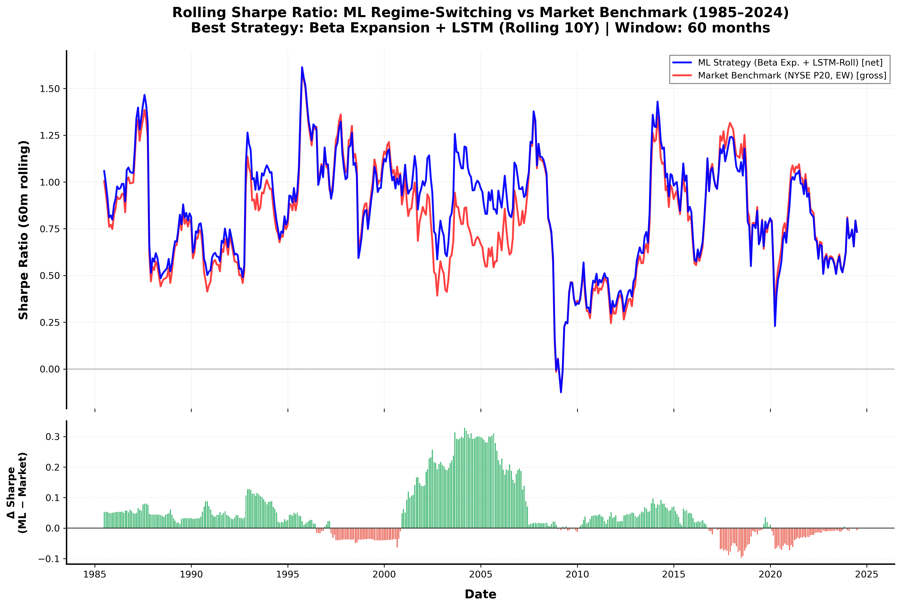

[](https://www.python.org/downloads/)
[](LICENSE)
[](https://github.com/)


This document provides detailed technical documentation for **replicating all research results**.

**Scope**: End-to-End Asset Pricing & Machine Learning Workflow
**Data Flow**: Unidirectional DAG (Directed Acyclic Graph)
**License**: Apache 2.0 (See `LICENSE`)

---

## 📊 Key Results Preview

<div align="center">

| Performance of Best Strategies (1963-2024) | Rolling Sharpe Ratio with Delta |
|:---:|:---:|
|  |  |

</div>

---

## ⚙️ Installation & Environment

This project requires **Python 3.10+** and is optimized for **macOS (Apple Silicon)** using Metal acceleration for TensorFlow.


## ⚙️ Installation & Environment

This project requires **Python 3.10+** and is optimized for **macOS (Apple Silicon)** using Metal acceleration for TensorFlow.

### 1. Clone Repository

```bash
git clone https://github.com/jeyllani/adaptive-factor-allocation.git
cd adaptive-factor-allocation/project
```

### 2. Install Requirements

#### Option A: Conda (Recommended)

The most robust way to replicate the environment is via Conda:

```bash
# 1. Create environment from configuration file
conda env create -f environment.yml

# 2. Activate the environment
conda activate afactors

# 3. Register kernel for Jupyter
python -m ipykernel install --user --name=afactors --display-name "Python (Adaptive Factors)"
```

#### Option B: Pip / Venv

If you prefer standard Python virtual environments:

```bash
# 1. Create virtual environment
python3.10 -m venv .venv

# 2. Activate environment
source .venv/bin/activate

# 3. Install dependencies
pip install --upgrade pip
pip install -r requirements.txt
```
---

### Data Access Policy
This repository **does not** contain the proprietary raw data files (`data/raw/*`) required to run the `raw_data_processing/` pipeline. These datasets (CRSP, Compustat, CCM) are licensed from **WRDS (Wharton Research Data Services)**. Users must have their own valid academic or commercial license to access these files. The pipeline expects these files to be placed manually in `data/raw/` by the user.


---

## 📁 Repository Structure Map

```text
.
├── data/                                                         # Data files (not version-controlled)
│   ├── signals/
│   │   └── signals_ALL.parquet                                   # 25 signals × 134,743 obs (1958-2024)
│   ├── portfolios/
│   │   ├── *_signal.parquet                                      # Single-sorted portfolios (25 files)
│   │   └── doublesorting/                                        # Size-adjusted portfolios (20 files)
│   ├── factors/
│   │   └── ff/                                                   # Fama-French factor returns
│   └── ml_data/                                                  # ML features and predictions
│       ├── baskets/                                              # 5 basket strategies
│       ├── features/                                             # 35 engineered features
│       ├── models/                                               # Trained models (LR, RF, XGB, LSTM)
│       └── portfolios/                                           # ML-based portfolio allocations
│
├── results/                                                      # All outputs (figures, tables, LaTeX)
│   ├── figures/
│   │   ├── main/                                                 # Main paper figures
│   │   └── appendix/                                             # Additional figures
│   ├── tables/                                                   # CSV tables
│   └── latex/
│       └── results/                                              # LaTeX-ready tables and figures
│
├── raw_data_processing/                                          # Data Cleaning Pipeline
│   ├── 001_crsp_ccm_converting_to_parquet.ipynb
│   ├── 002_crsp_bankruptcy_processing_merging.ipynb
│   ├── 003_data_preparation.ipynb
│   └── 004_checkup_data_integrity.ipynb
│
├── 01_signal_formation.ipynb                                     # Signal computation from fundamentals
├── 02_backtesting_engine.ipynb                                   # Portfolio construction & backtesting
├── 03_single_sorting_&_stats_analysis.ipynb                      # Fama-MacBeth, univariate analysis
├── 04_double_sorting_robustness_size.ipynb                       # Size-adjusted double sorts
├── 05_subperiod_analysis.ipynb                                   # Decade-by-decade performance
│
├── 06_1_ML_NYSEP20_EW_Benchmark_creation.ipynb                   # Benchmark portfolio
├── 06_2_ML_Basket_1_Economic_Classification.ipynb                # Basket 1: Economic signals
├── 06_3_ML_Basket_2_Expanding_Beta_Classification.ipynb          # Basket 2: Expanding beta
├── 06_4_ML_Basket_3_Rolling_Beta_Classification.ipynb            # Basket 3: Rolling beta
├── 06_5_ML_Basket_4_EWMA_Beta_Classfication.ipynb                # Basket 4: EWMA beta
├── 06_6_ML_Basket_5_Kalman_Beta_Classification.ipynb             # Basket 5: Kalman beta
│
├── 07_1_ML_Volatility_Targets_Creation.ipynb                     # Create high/low vol targets
├── 07_2_ML_Features_Creation.ipynb                               # Engineer 35 features
│
├── 08_1_ML_Regime_Classification_1_Logistic_Regression.ipynb     # Model 1: Logistic
├── 08_2_ML_Regime_Classification_2_Random_Forest.ipynb           # Model 2: RF
├── 08_3_ML_Regime_Classification_3_XGBoost.ipynb                 # Model 3: XGBoost
├── 08_4_ML_Regime_Classification_4_LSTM_Multi.ipynb              # Model 4: LSTM (Mac Optimized)
│
├── 09_1_ML_Backtest_Logistic.ipynb                               # Backtest Logistic predictions
├── 09_2_ML_Backtest_Random_Forest.ipynb                          # Backtest RF predictions
├── 09_3_ML_Backtest_XGBoost.ipynb                                # Backtest XGBoost predictions
├── 09_4_ML_Backtest_LSTM_Expanding.ipynb                         # Backtest LSTM (expanding)
├── 09_5_ML_Backtest_LSTM_Rolling_10y.ipynb                       # Backtest LSTM (rolling 10y)
│
├── 10_0_Transaction_Costs_Modelling.ipynb                        # TC impact analysis
│
├── 12_0_Data_Export_Descriptive_.ipynb                           # Export descriptive stats
├── 12_1_Results_Export_Performance.ipynb                         # Export performance metrics
├── 12_2_Results_Export_Factor_Analysis.ipynb                     # Export FF6 alpha results
├── 12_3_Results_Export_ML_Analysis.ipynb                         # Export ML classification results
│
└── README.md                                                     # Project Overview
```

---

## 🏛️ Pipeline Execution Steps

### 1. Data Preparation
**Directory**: `raw_data_processing/`

**Goal**: Transform raw CRSP/Compustat/CCM CSV files into a clean, Point-in-Time (PIT) aligned Parquet panel.

#### Step 001-004: Raw Data Processing
*   **Context**: Reads GBs of raw CSV data, merges CRSP and Compustat, handles delisting returns (Shumway 1997), and creates a valid panel.
*   **Inputs**:
    *   `data/raw/crsp_monthly.csv`
    *   `data/raw/ccm_annual.csv`
    *   `data/raw/delisting_returns.csv`
*   **Outputs**:
    *   `data/signalbaseline/panel_processed.parquet` (Main panel for signal formation)
    *   `data/raw/crsp_daily.parquet` (Daily returns for volatility calculation)

---

### 2. Asset Pricing Foundation
**Directory**: Root

**Goal**: Construct academic signals, form portfolios, and validate standard asset pricing anomalies.

#### [01] Signal Formation
*   **Notebook**: `01_signal_formation.ipynb`
*   **Description**: Computes 25 accounting signals (profitability, investment, momentum, etc.) from the processed panel. Handles winsorization and lagging.
*   **Inputs**:
    *   `raw_data_processing/data/signalbaseline/panel_processed.parquet`
*   **Outputs**:
    *   `data/signals/signals_ALL.parquet`

#### [02] Backtesting Engine
*   **Notebook**: `02_backtesting_engine.ipynb`
*   **Description**: Forms Univariate (P1-P10) and Long-Short portfolios based on signals. Sorts stocks into deciles.
*   **Inputs**:
    *   `data/signals/signals_ALL.parquet`
    *   `data/factors/ff/FF5.csv` (Fama-French 5 Factors)
*   **Outputs**:
    *   `data/portfolios/*.parquet` (25 individual signal portfolio files, e.g., `gross_profitability_signal.parquet`)
    *   `data/portfolios/doublesorting/*.parquet` (Size-controlled portfolios)

#### [03-05] Statistical Analysis
*   **Notebooks**: `03_single_sorting_...`, `04_double_sorting_...`, `05_subperiod_...`
*   **Description**: Performs Fama-MacBeth regressions, T-tests, Monotonicity checks, and Sub-period robustness tests.
*   **Inputs**:
    *   `data/portfolios/*.parquet`
    *   `data/factors/ff/FF5.csv`
    *   `data/factors/q5/q5m.csv`
*   **Outputs**:
    *   `results/latex/tables/*.tex`
    *   `results/figures/*.png`

---

### 3. Machine Learning Preparation
**Directory**: Root

**Goal**: Create targets (economic baskets, volatility regimes) and features for the ML models.

#### [06.1] Market Benchmark Creation
*   **Notebook**: `06_1_ML_NYSEP20_EW_Benchmark_creation.ipynb`
*   **Inputs**:
    *   `data/signals/signals_ALL.parquet`
*   **Outputs**:
    *   `data/ml_data/market/market_returns_ew_nys80.parquet`

#### [06.2-6] Economic Baskets Construction
*   **Notebooks**: `06_2` to `06_6` (One per basket type)
*   **Description**: Aggregates individual signal portfolios into 5 thematic baskets (Economic, Beta Expansion, Rolling Beta, EWMA Beta, Kalman Beta).
*   **Inputs**:
    *   `data/portfolios/*.parquet`
    *   `data/ml_data/market/market_returns_ew_nys80.parquet`
*   **Outputs**:
    *   `data/ml_data/baskets/basket_1_economic_classification.parquet`
    *   `data/ml_data/baskets/basket_2_beta_expansion.parquet`
    *   `data/ml_data/baskets/basket_3_beta_rolling.parquet`
    *   `data/ml_data/baskets/basket_4_beta_ewma.parquet`
    *   `data/ml_data/baskets/basket_5_beta_kalman.parquet`

#### [07] Feature & Target Engineering
*   **Notebooks**: `07_1_ML_Volatility_Targets_Creation.ipynb`, `07_2_ML_Features_Creation.ipynb`
*   **Description**: Creates the binary target variable (0=Low Vol, 1=High Vol) and engineers 35 predictive features (Macro, Technical, Beta, etc.).
*   **Inputs**:
    *   `data/ml_data/market/market_returns_ew_nys80.parquet`
    *   `data/factors/ff/FF5.csv`
*   **Outputs**:
    *   `data/ml_data/volatility_targets/volatility_targets_y.parquet`
    *   `data/ml_data/features/features_monthly.parquet`

---

### 4. Machine Learning Model Training
**Directory**: Root

**Goal**: Train predictive models (Logistic, RF, XGB, LSTM) to forecast volatility regimes.

#### [08.1-3] Tree & Linear Models
*   **Notebooks**: `08_1_Logistic`, `08_2_Random_Forest`, `08_3_XGBoost`
*   **Inputs**:
    *   `data/ml_data/features/features_monthly.parquet`
    *   `data/ml_data/volatility_targets/volatility_targets_y.parquet`
*   **Outputs**:
    *   `data/ml_data/models/logistic/predictions.parquet`
    *   `data/ml_data/models/random_forest/predictions.parquet`
    *   `data/ml_data/models/xgboost/predictions.parquet`

#### [08.4] Deep Learning (LSTM) - ⚠️ Mac Optimized
*   **Notebook**: `08_4_ML_Regime_Classification_4_LSTM_Multi.ipynb`
*   **Description**: Recurrent Neural Network for sequence learning.
*   **Specific Instructions**:
    *   **Optimization**: This notebook contains specific optimizations for macOS (Metal/MPS) and memory management (GC, Thread limits).
    *   **Configuration**: You must manually set the `STRATEGY` variable in the notebook to switch between modes.
        *   `STRATEGY = 'expanding'` (Accumulating history)
        *   `STRATEGY = 'rolling_10y'` (Rolling 10-year window)
*   **Inputs**:
    *   `data/ml_data/features/features_monthly.parquet`
    *   `data/ml_data/volatility_targets/volatility_targets_y.parquet`
*   **Outputs**:
    *   `data/ml_data/models/lstm/expanding/predictions.parquet`
    *   `data/ml_data/models/lstm/rolling_10y/predictions.parquet`

---

### 5. Strategy Backtesting & Reporting
**Directory**: Root

**Goal**: Simulate trading strategies based on ML predictions and export publication-ready results.

#### [09.x] ML Strategy Backtesting
*   **Notebooks**: `09_1` to `09_5`
*   **Description**: Takes OOS predictions, applies trading rules (Long Offensive if Low Vol, Long Defensive if High Vol), and calculates equity curves.
*   **Inputs**:
    *   `data/ml_data/models/{model}/predictions.parquet`
    *   `data/ml_data/baskets/*.parquet`
*   **Outputs**:
    *   `data/ml_data/models/portfolio_results/{model}/portfolio_results_monthly.parquet`

#### [10] Transaction Cost Analysis
*   **Notebook**: `10_0_Transaction_Costs_Modelling.ipynb`
*   **Description**: Models realistic transaction costs based on Frazzini (2018).
*   **Inputs**:
    *   `data/signals/signals_ALL.parquet`
*   **Outputs**:
    *   `data/ml_data/transaction_costs/tc_timeseries.parquet`

#### [12] Results Aggregation & Export
*   **Notebooks**: `12_1_Performance`, `12_2_Factor_Analysis`, `12_3_ML_Analysis`
*   **Description**: Aggregates all results, performs final Alpha decomposition (FF6/Q5), and generates LaTeX tables.
*   **Inputs (12_1)**:
    *   `data/ml_data/portfolios/*/*.parquet`
    *   `data/ml_data/baskets/*.parquet`
*   **Outputs (12_1)**:
    *   `data/results/monthly_returns_ml_by_model_basket.parquet` (Master Results File)
    *   `results/latex/results/01_performance.tex`
*   **Inputs (12_2)**:
    *   `data/results/monthly_returns_ml_by_model_basket.parquet`
    *   `data/factors/ff/FF5.csv`
*   **Outputs (12_2)**:
    *   `results/latex/results/10_ff6_regressions.tex`

---

## 🚀 Application Roadmap (Phase 2 & 3)

The next phase moves from static research verification to an **Interactive Alpha Research Lab** powered by [](https://streamlit.io).

```text
       ┌─────────────────────────────────────────────────────────────┐
       │               🌊  STREAMLIT DASHBOARD (v2.0)                │
       │                  "Adaptive Alpha Laboratory"                │
       └──────────────┬──────────────────────────────┬───────────────┘
                      │                              │
          ┌───────────▼───────────┐      ┌───────────▼───────────┐
          │  ⚙️  CONFIGURATION    │      │  🧠  ML CORE ENGINE   │
          │───────────────────────│      │───────────────────────│
          │ • Volatility Model    │◄────►│ • Model Selection     │
          │   (GARCH / EWMA)      │      │   (LSTM / XGB / RF)   │
          │ • Feature Selection   │      │ • Regime Prediction   │
          │   (Macro / Tech)      │      │ • Signal Confidence   │
          │ • Portfolio Deciles   │      │                       │
          │   (Top/Bottom/LS)     │      └───────────┬───────────┘
          └───────────┬───────────┘                  │
                      │                              │
          ┌───────────▼───────────┐      ┌───────────▼───────────┐
          │  📊  VISUALIZATION    │◄────►│  ⚖️  PORTFOLIO OPTIM  │
          │───────────────────────│      │───────────────────────│
          │ • Interactive Charts  │      │ • Dynamic Allocation  │
          │ • Regime Heatmaps     │      │ • Transaction Costs   │
          │ • P&L Decomposition   │      │ • Risk Parity / MVO   │
          └───────────────────────┘      └───────────────────────┘
```

**Planned Features:**
1.  **Dynamic Parameter Injection**: Real-time adjustment of looking-back windows (Rolling vs Expanding).
2.  **Model Ensembling**: Weighted average of LSTM and XGBoost predictions.
3.  **Advanced Transaction Costs**: Dynamic spread modeling and market impact analysis.
4.  **Model Selection**: Switch between LSTM and XGBoost predictions.
5.  **Portfolio Deciles**: Switch between Top/Bottom/LS deciles.
6.  **Combination trees**: Use a tree-based approach to combine the predictions of the models.
7.  **Automated Factor Interpretation**: Auto-regressive testing of new factor models (e.g., Q5, Fama-French 6) with automated interpretation of alpha.
8.  **Custom Stress Testing**: User-defined regime overrides (e.g., "Force High Volatility").


---

## 📬 Contact

For any questions or issues regarding this codebase, please **[contact the author](mailto:abdul.jeylanibakari@gmail.com)**.

